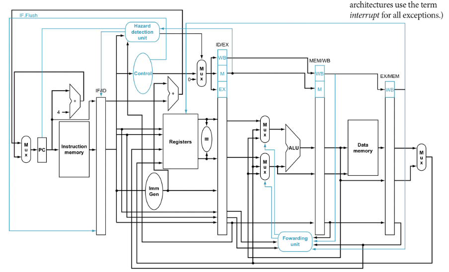

# RISC-V CPU

32 bit RISC-V Core

# Overview

Our own RISC-V CPU RTL design.



# Directories

| Name                | Contents                                            |
| ------------------- | --------------------------------------------------- |
| RISCV               | FPGA codes for actual working                       |
| algorithm           | MergeSort assembly & Instructions for this cpu      |
| testingModules      | Testing Each 5 stage pipeline modules               |
| BPML                | Machine Learning for Dynamic Branch Prediction      |
| img                 | Images for README                                   |

# References

* Computer Organization and Design RISC-V Edition The Hardware Software Interface by David A. Patterson, John L.Hennessy
* [vezzalinistefano/riscv-mergesort](https://github.com/vezzalinistefano/riscv-mergesort)

# How to simulate Each Verilog Modules

if your os is windows, then install Xilinx ISE Design Suite.
However, Xilinx is not available in Mac.

## installation for Mac

to install icarus-verilog,

``` shell
brew install icarus-verilog
```

to install gtkwave,
you just google "gtkwave" and download it anyway.

### icarus-verilog

for compile verilog files, 

``` shell
iverilog -o <output file name> <module.v> <tb_module.v>
```

> you should add below codes in your testbench to make vcd files.

``` verilog
initial begin
	$dumpfile("fileName.vcd");
	$dumpvars(0,ModuleNameOfTestBench);
end
```
and then, you have to make waveform file(.vcd file).

``` shell
vvp <output file name you made above>
```

### gtkwave

just double click on your waveform file(.vcd file) you made above.