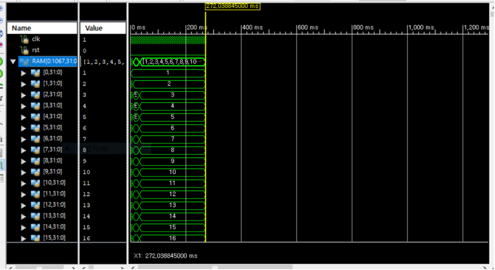
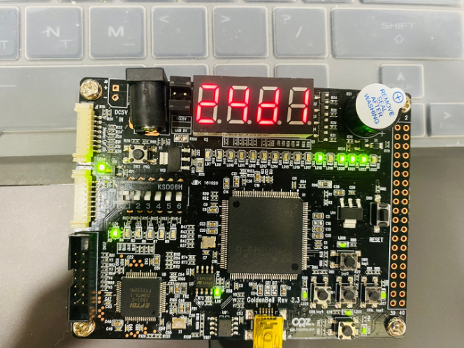

# Description of Codes

There are 7 modules for 5 pipeline stage and 2 modules for FPGA monitor.

| Name                  | Contents                                            |
| --------------------- | --------------------------------------------------- |
| InFetch               | Fetch instructions and increment PC                 |
| InDecode              | Decode instructions and make Ctrl Signal, Immediate |
| Execution             | ALU working                                         |
| Memory                | Memory(RAM) load or sotre                           |
| WB                    | Write back values in Registers                      |
| Forwarding_unit       | Generating Forwarding signal if data hazard happens |
| Hazard_detection_unit | Generating Stall Signal                             |
| LED_channel           | LEDs for FPGA                                       |
| Counter               | Validates that memory sorted in 1 ~ 1000            |

# Solving Sorting problem

This codes run Merge Sort Instructions on FPGA.
in RAM, there are 1 ~ 1000 values not in order.
in ROM, there are Merge Sort Instructions

# Results

on simulation,  

on fpga, sorting finished at 0x24D1 cycle.  
