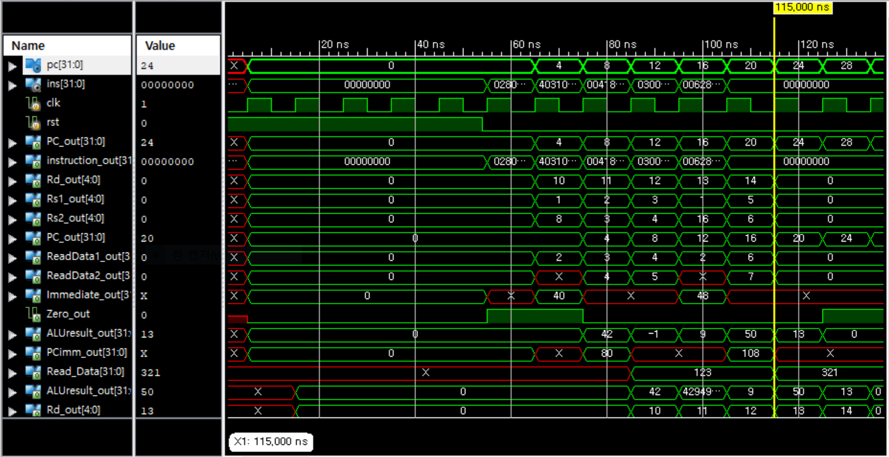

# RISCV pipeline

wired all 5 stages modules.

# Test Bench

## darksocv.mem

You should check InFetch Module that it reads right file.

``` verilog
initial begin
	for(i=0; i!=ROM_size; i=i+1) begin
		ROM[i] = 32'b0;
	end
	$readmemh("./darksocv.mem",ROM);
end
```

in darksocv.mem,

```
0x0280A503
0x403105B3
0x00418633
0x0300A683
0x00628733
```

They means

```
lw x10, 40(x1);
sub x11, x2, x3;
add x12, x3, x4;
lw x13, 48(x1);
add x14, x5, x6;
```

respectively.

### Initial values in Register and Memory

x0 has 0. x1 to x6 has 2 to 7 respectively.
mem[42] = 123 and mem[50] = 321.

This is arbitary initial value for the test. 
Waveform should be like below.



## darksocv2.mem

You should check InFetch Module that it reads right file.

``` verilog
initial begin
	for(i=0; i!=ROM_size; i=i+1) begin
		ROM[i] = 32'b0;
	end
	$readmemh("./darksocv2.mem",ROM);
end
```

in darksocv2.mem,

```
0x0140B103
0x00510233
0x40230433
0x002204B3
0x406480B3
```

They means

```
lw x2, 20(x1);
add x4, x2, x5;
sub x8, x6, x2;
add x9, x4, x2;
sub x1, x9, x6;
```

respectively.

### Initial values in Register and Memory

x0 has 0. x1 to x6 has 2 to 7 respectively.
mem[22] = 12.

This is arbitary initial value for the test. 
Waveform should be like below.

